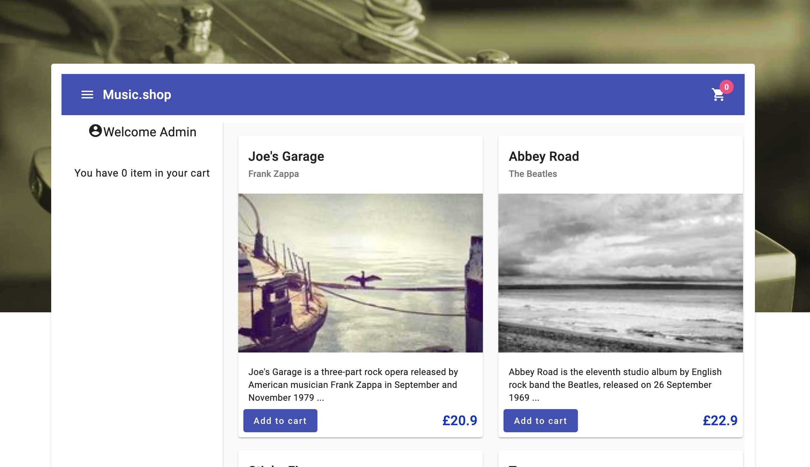

# Album Wholesale Angular V16

This project is a simple product cart application. It allows the user to add or remove products to the cart.
This project was generated with [Angular CLI](https://github.com/angular/angular-cli) version 16.0.0.

It aims to be converted with angular v17+ and its new features. 

## Development server

This project run a fake backend server with json-server. To run the project, you need to run first ```npm run api```
This will start the json-server on port 3000. 

Then you can run the project with ```npm start``` or ```ng serve```.

Navigate to `http://localhost:4200/`.

## Result:
You should see the following on the screen when you access too ```http://localhost:4200/shop```



# LABS
## PWA
### Step 1: PWA
 - Install pwa using  `ng add @angular/pwa`
 - build the app and run it with http-server (`npm install -g http-server`).
 - build the app with `ng build`
   - Be sure to run http-server from the dist folder where the `index.html` file is located
     - `http-server -p 3002 -c-1 <path to project in dist folder>`
   - Check that the service worker is here (in the developer options). Turn off the server to see if the app is working.
### Step 2: Caching
  - Add the following to the `ngsw-config.json` file:
    ```json
    "dataGroups": [
    {
      "name": "<NAME>",
      "urls": ["<URL>/**"],
      "cacheConfig": {
        "strategy": "freshness",
        "maxSize": 20,
        "maxAge": "1h",
        "timeout": "5s"
      }
    }
    ]
    ```
   - Disconnect the server and check that data from the backend are displayed from the cache
### Step 3: Update Notifications
 - Create a service for the update notifications of the service worker
  - Inject `SwUpdate` and `VersionReadyEvent` from `@angular/service-worker` in the service  
  - Use `versionUpdates` to check if there is a new version of the app. it's an observable
  - Now you can subscribe to the observable and show a notification to the user or in the console
  - Build the project again, you don't need to restart the server
  - Reload the page. it should show a notification if there is a new version
