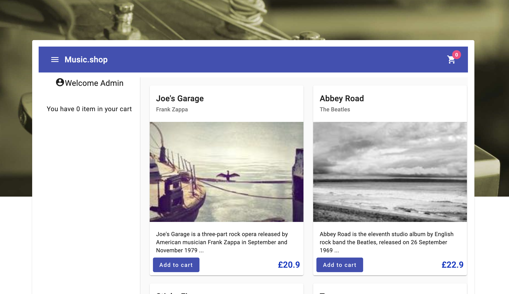

# Album Wholesale Angular V16

This project is a simple product cart application. It allows the user to add or remove products to the cart.
This project was generated with [Angular CLI](https://github.com/angular/angular-cli) version 16.0.0.

It aims to be converted with angular v17+ and its new features. 

## Development server

This project run a fake backend server with json-server. To run the project, you need to run first ```npm run api```
This will start the json-server on port 3000. 

Then you can run the project with ```npm start``` or ```ng serve```.

Navigate to `http://localhost:4200/`.

## Result:
You should see the following on the screen when you access too ```http://localhost:4200/shop```




1 / Dans le reducer de cart, on initialise notre store et on met une valeur par faut dans le cart,
     Pensez à enregistrer le store dans app.module.ts
2 / Afficher le contenu du panier qui vient du store dans la sidebar de gauche sur l'application
